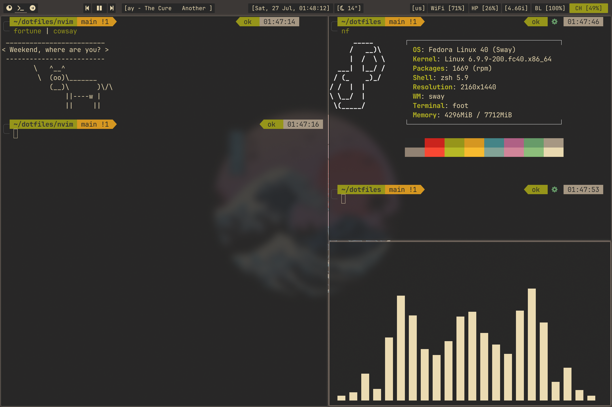

# sway dotfiles



------
|                           | Wayland                 |
|----------------------|---------------------------|
| **Shell:**         | zsh + p10k            | 
| **WM:**           | sway + waybar     | 
| **Editor:**       | nvim                      | 
| **Terminal:** | foot                        |
| **Launcher:** | wofi                       | 
|**Distro:** | Fedora 40 |
------

### Installing

To install all configs to ~/.config just run ./install.sh. You can also choose that dotfiles you want to copy with comment/uncomment choosen configs in ./install.sh.

```shell
#!/bin/bash

source    ./funs.sh

sway
waybar
neofetch
foot
# nvim
# zsh
# p10k
scripts
# swaylock
wofi
```
